<!-- ═══════════ HERO (auto light / dark) ═══════════ -->
<picture>
  <source media="(prefers-color-scheme: dark)" srcset="assets/banner-dark.svg" />
  <source media="(prefers-color-scheme: light)" srcset="assets/banner-light.svg" />
  
</picture>

  
  
  
  

I build <b>production AI systems — agents, retrieval pipelines, and the APIs behind them</b> — 
and research how they can become <b>reliable, explainable, and accountable</b> in the real world.

<table align="center">
<tr>
<td align="center" width="25%"> <b>AI Engineer</b> Ran AI Pvt. Ltd.</td>
<td align="center" width="25%"> <b>CTO & Co-founder</b> Nexpage Technologies</td>
<td align="center" width="25%"> <b>Lab Engineer</b> Data Science · Bahria University</td>
<td align="center" width="25%"> <b>MS Artificial Intelligence</b> BS CS · Bahria University</td>
</tr>
</table>

##  &nbsp;Featured Projects

<table>
<tr>
<td width="50%" valign="top">

### [🎙️ Meetly AI](https://github.com/umartariqdev330/Fathom-AI)
AI meeting notetaker: synced transcripts, template-based summaries, action items, cross-meeting search, and public clip links.

  

</td>
<td width="50%" valign="top">

### [🧩 Chatbot Studio](https://github.com/umartariqdev330/chatbot_studio)
No-code RAG chatbot builder where every bot gets its own system prompt and an isolated document knowledge base.

  

</td>
</tr>
<tr>
<td valign="top">

### [📚 DocChat](https://github.com/umartariqdev330/doc_chat)
Chat with your documents: grounded answers with page-level citations and a router agent.

  

</td>
<td valign="top">

### [💙 CARE](https://github.com/umartariqdev330/depression_care)
Early detection of depression from text, across a Flutter app, a FastAPI ML service, and a Next.js web client.

  

</td>
</tr>
</table>

Also: <a href="https://github.com/umartariqdev330/clear_cut"><b>ClearCut</b></a>, an AI background remover (React · FastAPI · U²-Net) · <a href="https://clear-cut-lpzf.vercel.app/">live demo</a>

##  &nbsp;Research

| Paper | Area |
| :-- | :-- |
| **An Agentic Hybrid RAG Framework for Intelligent University Policy Navigation**   | Hybrid RAG · Multi-LLM · RAGAS |
| **Machine Learning–Based Intrusion Detection for Wireless Sensor Networks** | AI Security · WSN |
| **Spot-Energy-Aware Checkpointing for Cloud-Based LLM Fine-Tuning** | Efficient LLM Training |

**Interests:** Trustworthy & Explainable AI · Agentic LLMs with human oversight · RAG · LLM Reasoning & Evaluation · AI Security &nbsp;→&nbsp; [**All publications**](https://scholar.google.com/citations?user=eAq5VDQAAAAJ&hl=en)

##  &nbsp;Tech Stack

  <picture>
    <source media="(prefers-color-scheme: dark)" srcset="https://skillicons.dev/icons?i=python,pytorch,tensorflow,sklearn,opencv,fastapi,django,nodejs,ts,react,nextjs,tailwind,flutter,mongodb,postgres,docker,linux,git,githubactions,vercel&theme=dark&perline=10" />
    
  </picture>

  
  
  
  
  
  
  

##  &nbsp;Recognition

  🥈 <b>2nd Position</b>, Final Year Project &nbsp;·&nbsp;
  🏆 <b>Runner-up</b>, Codex Hackathon (National) &nbsp;·&nbsp;
  ⭐ <b>Best Intern</b>, Sapphire Technologies 
  📜 <b>IBM Generative AI Engineering</b> &nbsp;·&nbsp; 📊 <b>IBM Data Science Professional</b>

 

<picture>
  <source media="(prefers-color-scheme: dark)" srcset="assets/footer-dark.svg" />
  <source media="(prefers-color-scheme: light)" srcset="assets/footer-light.svg" />
  
</picture>
